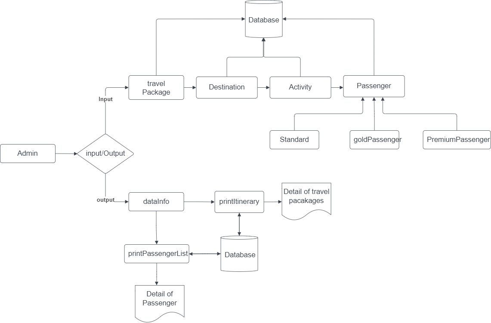
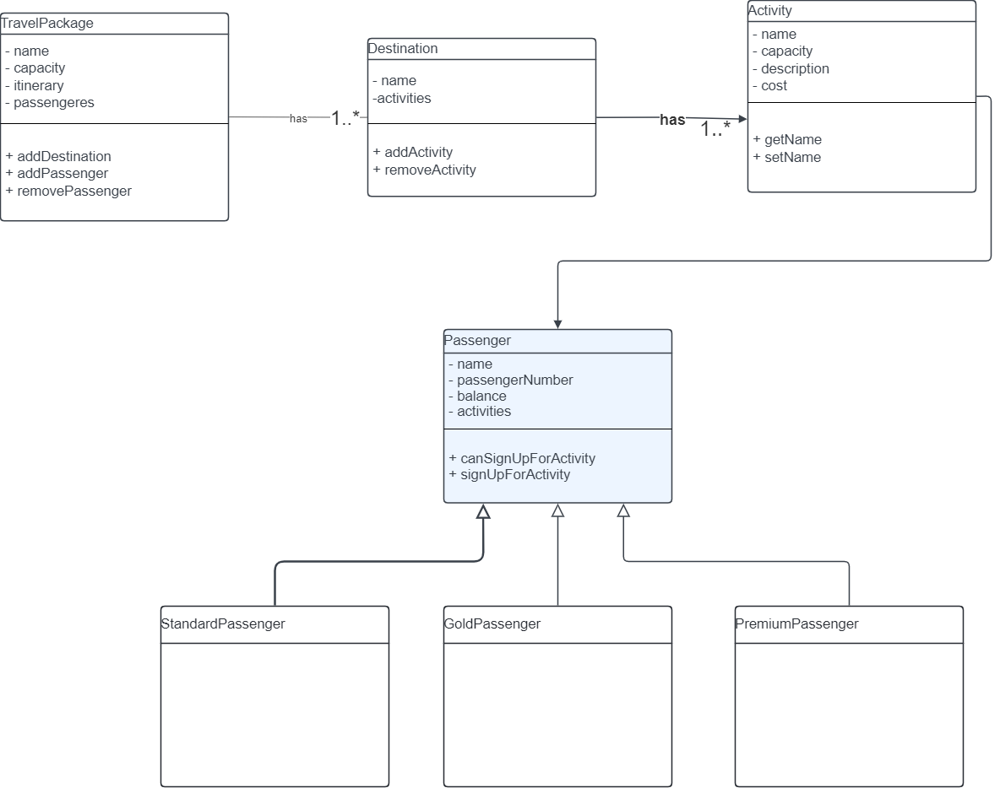
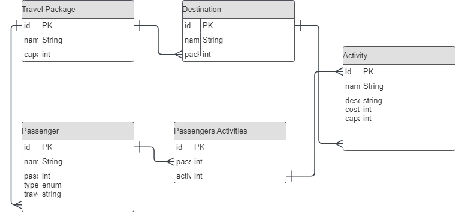

# Travel Agency Management System

## Task

Design, implement and test a software system that allows travel agencies to maintain their travel packages' itinerary and passengers.

## Installation

1. Clone the repository:
   git clone https://github.com/your-username/travel-agency-project.git

2. Set up the project dependencies and database.

## Usage

1. Run the application.
2. Use the command-line interface or GUI to manage travel packages, activities, destinations, and passengers.

## Techstacks Used

- Netbeans
- MySQL
- Java

## Database Setup

1. Create the database schema using the provided SQL scripts.
2. Insert sample data for testing.

## Contributing

1. Fork the repository.
2. Create a new branch for your feature or fix.
3. Commit your changes and push to your fork.
4. Submit a pull request to the main repository.

## License

This project is licensed under the MIT License.

## Screenshots

### High-Level Design

A block diagram indicating interaction between different sub-blocks.

### Low-Level Design

    A UML class diagram of all the classes that needs to implemented.

### ER Diagram

ER model to show the relationship of how the tables are implemented in SQL.

